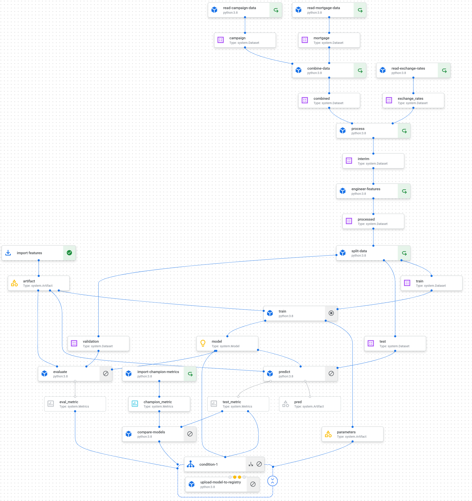

# Customer classification

The repository contains the source code of the cloud training workflow to develop the binary customer classifier with xgboost. The purpose of the classifier is to target customers in a marketing campaign.

## Data scheme

The data used in the project is synthetically generated campaign and mortgage datasets with the schemas as follows.

### Campaign dataset

```
>>> campaign.info()

<class 'pandas.core.frame.DataFrame'>
RangeIndex: 32060 entries, 0 to 32059
Data columns (total 16 columns):
 #   Column                Non-Null Count  Dtype
---  ------                --------------  -----
 0   participant_id        32060 non-null  int64
 1   name_title            19859 non-null  object
 2   first_name            32060 non-null  object
 3   last_name             32060 non-null  object
 4   age                   32060 non-null  int64
 5   postcode              32060 non-null  object
 6   marital_status        32060 non-null  object
 7   education             32060 non-null  object
 8   job_title             32060 non-null  object
 9   occupation_level      32060 non-null  int64
 10  education_num         32060 non-null  int64
 11  familiarity_nw        32060 non-null  int64
 12  view_nw               32060 non-null  int64
 13  interested_insurance  32060 non-null  int64
 14  company_email         32060 non-null  object
 15  created_account       3027 non-null   object
dtypes: int64(7), object(9)
memory usage: 3.9+ MB
```
### Mortgage dataset

```
>>> mortgage.info()

<class 'pandas.core.frame.DataFrame'>
RangeIndex: 32561 entries, 0 to 32560
Data columns (total 18 columns):
 #   Column                      Non-Null Count  Dtype
---  ------                      --------------  -----
 0   full_name                   32561 non-null  object
 1   dob                         32561 non-null  object
 2   town                        32561 non-null  object
 3   paye                        32561 non-null  object
 4   salary_band                 32561 non-null  object
 5   years_with_employer         32561 non-null  int64
 6   months_with_employer        32561 non-null  int64
 7   hours_per_week              32561 non-null  int64
 8   capital_gain                32561 non-null  int64
 9   capital_loss                32561 non-null  int64
 10  new_mortgage                32561 non-null  object
 11  sex                         32561 non-null  object
 12  religion                    32561 non-null  object
 13  relationship                32561 non-null  object
 14  race                        32561 non-null  object
 15  native_country              32561 non-null  object
 16  workclass                   32561 non-null  object
 17  demographic_characteristic  32561 non-null  int64
dtypes: int64(6), object(12)
memory usage: 4.5+ MB
```

## Available make commands

Only compile pipeline
```
make compile

```
Default local training run
```
make default-run params="[OPTIONS]"

OPTIONS:
  --exp-name EXP_NAME
  --seed SEED
  --threshold THRESHOLD
  --num-cat-cols NUM_CAT_COLS
  --val-to-train-split VAL_TO_TRAIN_SPLIT
  --test-to-all-split TEST_TO_ALL_SPLIT
  --boost-rounds BOOST_ROUNDS
  --folds FOLDS
  --eta ETA
  --max-depth MAX_DEPTH
  --n_estimators N_ESTIMATORS
  --min-child-weight MIN_CHILD_WEIGHT
  --subsample SUBSAMPLE
  --objective OBJECTIVE
  --eval-metric EVAL_METRIC
  --grow-policy GROW_POLICY
  --reg-lambda REG_LAMBDA
  --reg-alpha REG_ALPHA
```

Custom cloud training run
```
make custom-run-vertex params="[OPTIONS]"
    --compile_only
    --enable_caching
    --seed SEED
    --threshold THRESHOLD
    --num_cat_cols NUM_CAT_COLS
    --val_to_train_split VAL_TO_TRAIN_SPLIT
    --boost_rounds BOOST_ROUNDS
    --exp_name EXP_NAME
    --eta ETA
    --max_depth MAX_DEPTH
    --min_child_weight MIN_CHILD_WEIGHT
    --subsample SUBSAMPLE
    --objective OBJECTIVE
    --eval_metric EVAL_METRIC
    --grow_policy GROW_POLICY
    --reg_lambda REG_LAMBDA
    --reg_alpha REG_ALPHA
```

Unit tests
```
make unit-tests-vertex
```

Perform grid search hyper parameters tuning
```
make grid-tuning-run-vertex
```

Perform random search hyper parameters tuning
```
make random-tuning-run-vertex
```

## Cloud training workflow


